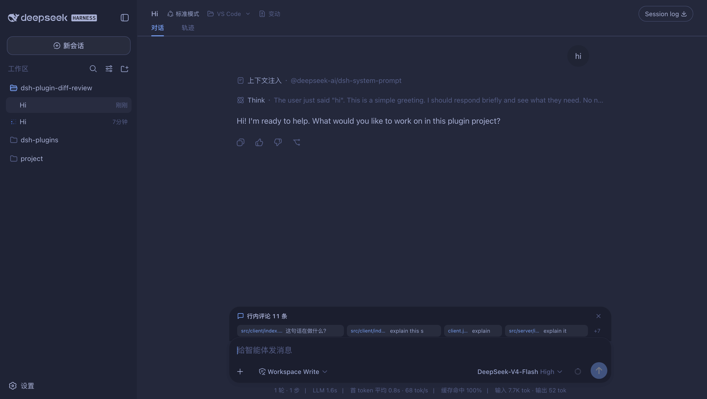
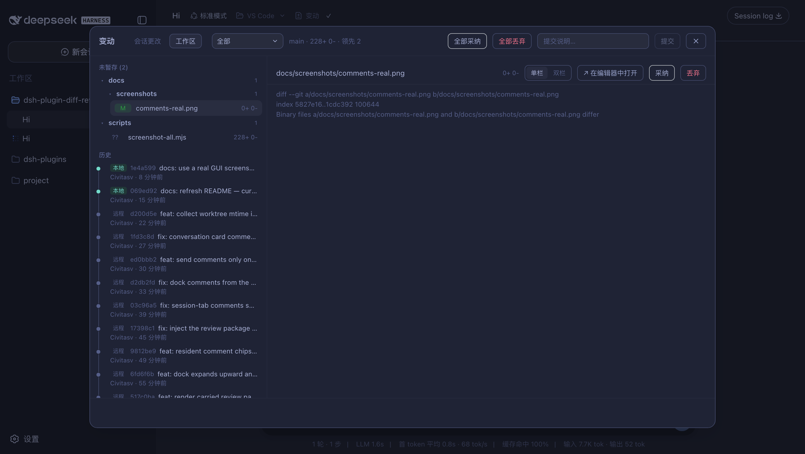
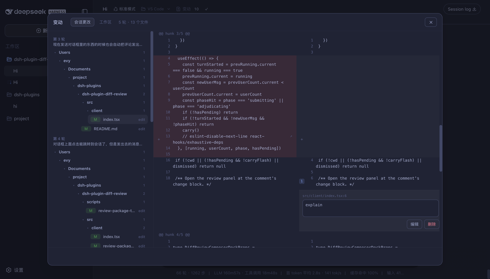

# dsh-plugin-diff-review

**变动（Changes）**：Codex 式 diff 审查插件，一个浮层面板提供两个视角 ——
**会话更改**（每轮对话代理改了什么，逐轮查看，不依赖 git）与
**工作区**（git 未提交更改：采纳/丢弃/提交/推送/历史/分支），并带行内评论
闭环（评论 → 发送给代理修复 → 复评审）与 AI 评审。

## 截图

（均为真实界面截图）

行内评论 chip 条 —— 评论常驻输入框上方（`路径:行号` + 摘要），点击 chip 跳到
对应变更块、点击顶栏发送，超过 4 条折叠为 +N：



工作区 —— 已暂存 / 未暂存 / 历史 / 分支与远程分区 + 逐文件 unified diff
（评论条同时浮于输入框上方）：





## 特性

### 工作区（git 工作树）

- 左侧按 **已暂存 / 未暂存 / 历史 / 分支与远程** 分区，右侧逐文件 unified diff
  （单栏 / 双栏）；
- **范围下拉**：全部 / 未暂存 / 已暂存 / 提交 / 分支 / 最后一轮（「分支」为
  merge-base 只读对比，「最后一轮」取当前会话最近一轮改动的文件）；
- **采纳 / 丢弃 / 取消暂存**：文件级与逐 hunk（未跟踪文件也能逐 hunk 暂存），
  丢弃需二次点击确认；「全部…」一键批量；
- **提交 / 推送**：输入说明提交已暂存更改；双击确认推送（显示领先/落后）；
- **AI 评审**：按当前范围调模型产出 P0–P3 发现与总体结论，**结论固定内联**在
  diff 视图（吸顶横幅 + 行内发现卡片，单/双栏均支持），「发送发现给代理」修复
  后可复评审；
- **PR(gh) 集成**：关联 GitHub PR 时显示 reviewer 评论，点击跳行、可聚合发送；
- **多仓库**：嵌套 / monorepo 自动识别，切换后所有操作针对所选仓库；
- **编辑器联动**：diff 头部/行号打开文件或定位到行（经 `dsh-plugin-open-editor`，
  支持 VS Code `--goto`、vim/emacs `+N`、Sublime `file:line`）；
- 切换工作区/标签页自动刷新，打开期间每 15 秒静默刷新。

### 行内评论（评审闭环）

- 单/双栏 diff 行 hover `+` 写评论（Ctrl/⌘+Enter 保存），有评论的行高亮显示角标；
  评论存于 `.git/diff-review-comments.json`（不进工作区与 git 历史）；
- 评论以 **chip 条常驻输入框上方**：每条 chip 显示 `路径:行号` + 摘要，点击
  跳到对应变更块（自动路由到会话更改或工作区页签），超过 4 条折叠为 +N；
- **点击顶栏显式发送**评审包（每条评论 + 对应 diff hunk + AI 评审结论）——
  不随普通消息自动发送，发送过的评论永不重发（按工作区持久化）；
- 发送后在会话里渲染为**可点击评审卡片**，点击任意评论直达对应代码。

### 会话更改（不依赖 git）

- 从会话记录提取**每一轮**代理修改的文件（含该轮提问摘要），每处展示完整
  按行 diff；无 diff 数据时仍列出路径与工具名；纯客户端计算。

## 一键安装

```sh
# macOS / Linux
bash install.sh

# Windows（PowerShell）
powershell -ExecutionPolicy Bypass -File install.ps1
```

脚本会：安装运行依赖 → 链接进 `~/.dsh/profiles/node_modules` → 注册到
`cordis.patch.yml` → 提示重启。

### 手动安装

仓库已包含构建产物（`dist/index.js` 与 `client.js`），修改源码后才需
`npm install && npm run build`。

```sh
# 1. 链接进 profile 依赖目录（Windows 用 Junction 等效命令）
ln -sfn "$PWD" ~/.dsh/profiles/node_modules/dsh-plugin-diff-review

# 2. 注册到 ~/.dsh/profiles/web/cordis.patch.yml
#    - insert:
#        - id: diff-review
#          name: dsh-plugin-diff-review

# 3. 重启 dsh web，会话页头出现「变动」按钮
```

## 使用

| 操作           | 效果                                                      |
| -------------- | --------------------------------------------------------- |
| 「变动」按钮   | 打开面板（默认工作区页签）                                |
| 范围下拉       | 全部 / 未暂存 / 已暂存 / 提交 / 分支 / 最后一轮           |
| 仓库选择器     | 多仓库时出现，切换后操作针对所选仓库                      |
| 评审           | 按范围调模型，P0–P3 发现 + 结论内联在 diff，可发送给代理 |
| hunk 操作      | 暂存 / 丢弃 / 取消暂存（只读范围不显示）                  |
| 行内评论       | hover 行 `+` 写评论；chip 条点击跳转、顶栏点击发送      |
| 在编辑器中打开 | diff 头部打开文件；行 hover ↗ 打开该行                   |
| 提交 / 推送    | 输入说明提交已暂存更改；双击确认推送                      |

字体与字号在 **设置 → 插件 → 插件配置 → 变动** 中调整（即时生效并持久化）。

> 「采纳」只是暂存，不会自动 commit —— 在提交框输入说明后点「提交」。

## 配置

编辑 `cordis.patch.yml` 中该插件的 `config`：

```yaml
- id: diff-review
  name: dsh-plugin-diff-review
  config:
    statusPath: /diff-review/status          # 以下为各路由（一般无需改动）
    applyPath: /diff-review/apply
    applyHunkPath: /diff-review/apply-hunk
    commitPath: /diff-review/commit
    pushPath: /diff-review/push
    historyPath: /diff-review/history
    commitDiffPath: /diff-review/commit-diff
    commentsPath: /diff-review/comments
    branchesPath: /diff-review/branches
    reviewPath: /diff-review/review
    prPath: /diff-review/pr
    reposPath: /diff-review/repos
    reviewProvider: ""                       # AI 评审 provider（如 deepseek-official）
    reviewModel: ""                          # AI 评审模型；两者为空时用会话当前模型
    allowedRoots: []                         # 非空时仅允许审查这些目录下的仓库
```

`allowedRoots` 只约束「工作区」页签的 git 操作；「会话更改」纯客户端，不经过服务器。

## 工作原理

**会话更改**（纯客户端）：读取会话快照，按用户消息划分"轮"；已完成的工具调用
若携带 diff hunks（`resultView` / `meta.diffs`）解析为 `{path, oldText, newText}`
归入对应轮次，无 diff 时仍列路径与工具名。

**工作区**（服务器端）：`git status --porcelain=v1 -z` + `git ls-files --others`
收集变更；采纳 = `git add`，丢弃 = `git restore`，取消暂存 = `git restore --staged`；逐 hunk：index 侧用 `git apply --cached`，工作区侧用 hunk 文本行级
替换写回（`git apply --reverse` 对 hunk 不落文件末尾的补丁不可靠）；提交 =
`git commit -m`，推送 = `git push`；行内评论存于 git-dir 下
`diff-review-comments.json`；AI 评审 = 按范围收集 diff → 解析模型（配置优先，
否则会话 `requestHeader().config`）→ `ctx.llm.stream` 严格 JSON 提示词 → 校验
发现（路径在评审文件集内、行号钳制）；PR = `gh pr view` + `gh api`（无 gh
静默降级）；多仓库 = `git rev-parse` 扫描工作区及一层子目录。所有 git 命令经
`execFile`（无 shell），路径带 `--` 且拒绝 `..` 穿越与绝对路径。

## 卸载

从 `cordis.patch.yml` 删除条目 → 删除 `~/.dsh/profiles/node_modules/dsh-plugin-diff-review`
链接 → 重启 `dsh web`。

## 常见问题

- **「最后一轮」是空的**：终端命令（bash）改文件不计入会话记录；用编辑工具改
  文件才会被记录，此时「会话更改」可确认记录来源。
- **「提交」/「推送」不可用**：没有已暂存的更改 / 分支没有领先提交或未配置
  上游（先 `git push -u` 一次）。
- **「发送给代理」没反应**：需要当前会话可用；失败时退化为复制文本，粘贴发送即可。
- **「评审」提示没有可用模型**：配置 `reviewProvider` + `reviewModel`，或先让
  会话发过一条消息（复用会话模型）。
- **「在编辑器中打开」失败**：需安装 `dsh-plugin-open-editor` 且编辑器在 PATH。
- **左侧没有 PR 区**：当前分支无关联 PR，或未安装/登录 `gh`。

## License

MIT
