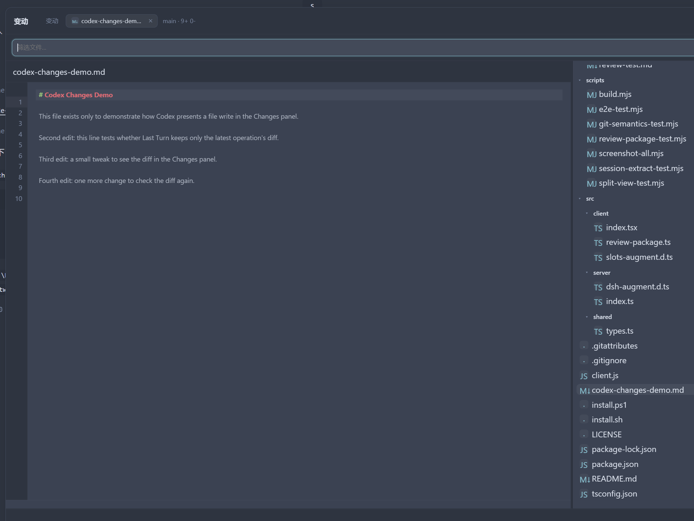

# dsh-plugin-diff-review

在 DSH 中查看和处理当前工作区的改动：浏览 diff、暂存或丢弃文件、提交与推送、添加行内评论，以及在内置文件页签中查看和编辑文件。

## 安装

```sh
# macOS / Linux
bash install.sh

# Windows PowerShell
powershell -ExecutionPolicy Bypass -File install.ps1
```

安装后重启 DSH。在会话页头点击 **变动** 即可打开评审工作台。

## 使用

### 查看改动

打开 **变动** 后，通过范围下拉选择要看的内容，例如“未暂存”“已暂存”“分支”或“最后一轮”。

- 点击文件查看 diff；可切换单栏或双栏。
- 使用文件上的 `+` 暂存、`↶` 丢弃或取消暂存。
- 点击行旁的 `+` 添加评论；发送评审后，代理会收到评论和对应上下文。

### 打开文件

在 Review 中点击“在 Files 中打开”，或在右侧文件树选择文件。

- 文件会打开为一个可关闭的动态 tab；重复打开同一文件不会重复创建。
- 在文件树切换到另一个文件时，当前 tab 会变为该文件；之后从 Review 再打开原文件会创建新 tab。
- 文件树会自动定位当前文件。文本文件可直接编辑并自动保存；图片会预览。



### 提交与推送

点击右上角 **提交**，填写提交说明后选择“提交”或“提交并推送”。

## 常见问题

- **最后一轮没有文件**：终端命令直接修改的文件不会出现在会话记录中；可切换到工作区范围查看 Git 改动。
- **在编辑器中打开失败**：安装并启用 `dsh-plugin-open-editor`，并确认目标编辑器可从 PATH 启动。
- **AI 评审不可用**：先在当前会话发送过消息，或在插件配置中填写可用的 provider 和 model。

## 开发时刷新

```sh
npm install
npm run build
```

重启 DSH 或刷新页面后查看改动。

## License

MIT
