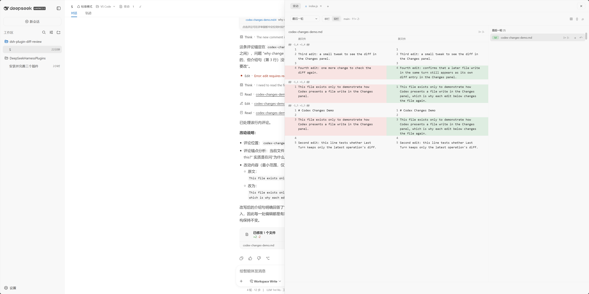
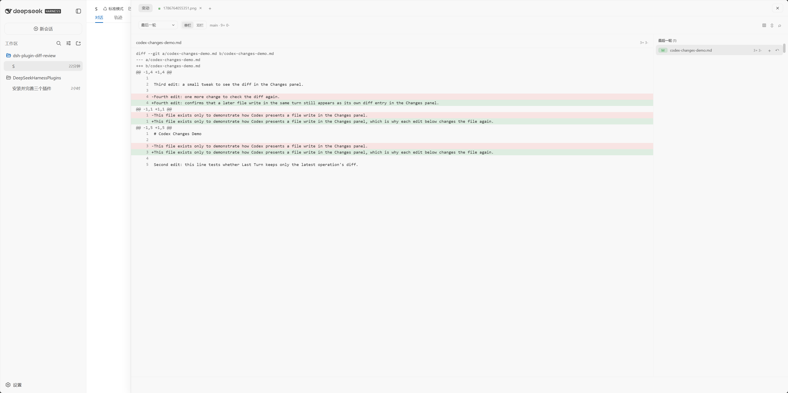
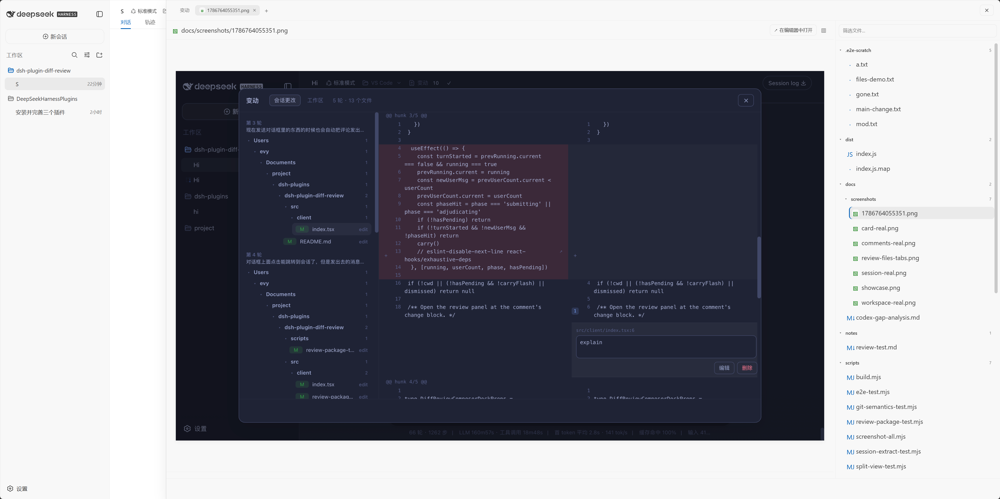
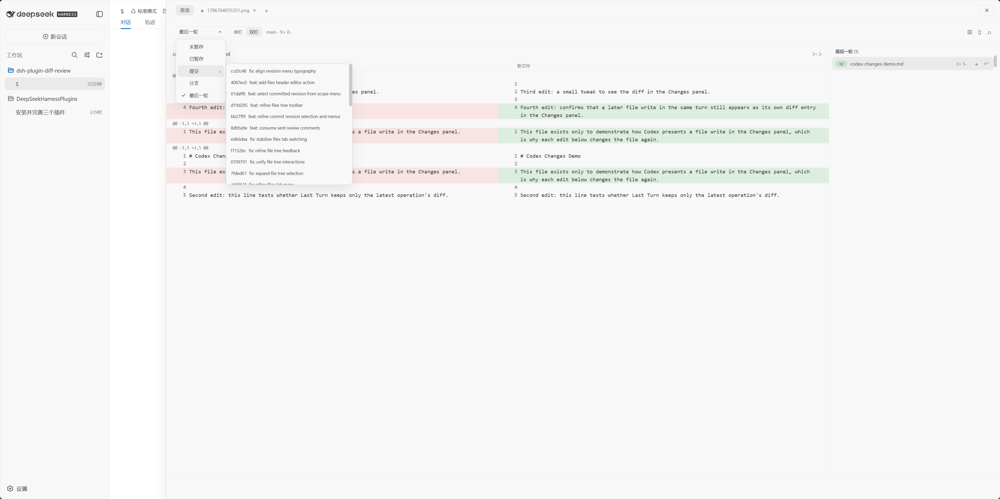
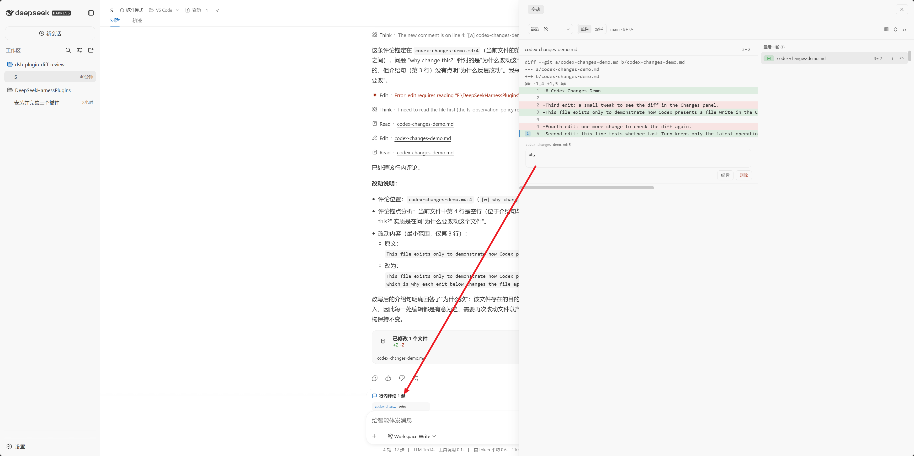
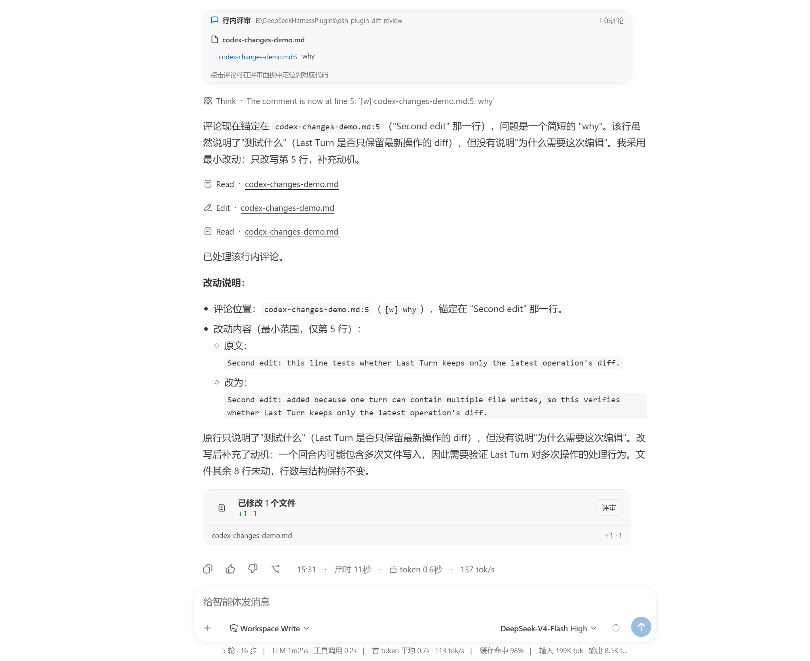

# dsh-plugin-diff-review

在 DSH 中查看、处理和评审当前工作区改动。点击会话页头的 **变动** 即可打开右侧评审工作台。



## 安装

### GitHub 安装

DSH 的 `plugin add` 支持 pnpm 的 GitHub 依赖格式。推荐固定到发布 tag，避免后续
`main` 的更新改变已安装版本：

```sh
dsh plugin --profile web add github:Civitasv/dsh-plugin-diff-review#<tag>
```

需要跟随最新版本时，改用：

```sh
dsh plugin --profile web add github:Civitasv/dsh-plugin-diff-review#main
```

`plugin add` 只负责将包安装到 web profile。首次安装还要在
`~/.dsh/profiles/web/cordis.patch.yml` 增加：

```yaml
- insert:
    - id: diff-review
      name: dsh-plugin-diff-review
```

随后重启 DSH。更新时重新执行同一条 `plugin add` 命令；使用 tag 时将版本替换为目标
tag。

### 本地开发安装

```sh
# macOS / Linux
bash install.sh

# Windows PowerShell
powershell -ExecutionPolicy Bypass -File install.ps1
```

脚本适合本地开发，会将当前目录链接到 profile；安装后重启 DSH。

## 查看改动

在 **变动** 中选择范围：最后一轮、未暂存、已暂存、提交 revision 或分支。点击文件可查看 diff；标题栏可切换单栏/双栏、跳转文件、收起 diff，以及显示或隐藏文件树。

选择 **提交** 后，在子菜单选择具体 revision 才会打开其 diff。



## 文件树

文件树可搜索、展开目录、拖拽调整宽度，并会定位当前打开的文件。右键文件可在编辑器中打开、复制路径或添加到当前对话。



## 文件页签

在文件树中选择文件，或从 Review 打开文件，会创建可关闭的文件页签。文本文件可直接编辑并自动保存；支持图片预览与常见代码/文档格式的高亮显示。



## 处理与提交

- 使用文件或 hunk 旁的按钮暂存、取消暂存或丢弃改动。
- 点击 **提交**，填写说明后选择提交、提交并推送或推送。

## 评论与摘要

在 diff 行旁添加评论，集中确认后发送给代理；成功发送后，评论会从待处理列表移除。



代理处理评论后，会在回复下方显示评审结果卡和本次文件改动摘要，可直接进入 Review 查看对应 diff。



## 常见问题

- **最后一轮没有文件**：终端命令直接修改的文件不会进入会话记录；请切换到未暂存或已暂存范围查看 Git 改动。
- **在编辑器中打开失败**：安装并启用 [dsh-plugin-open-editor](https://github.com/Civitasv/dsh-plugin-open-editor)，并确认目标编辑器可以从 PATH 启动。

## License

MIT
