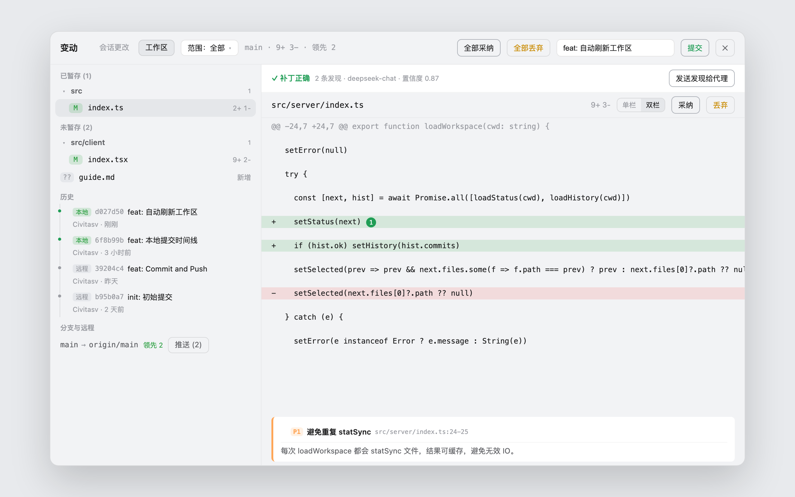
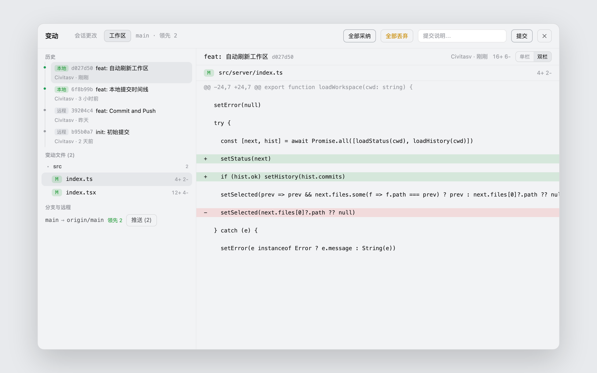
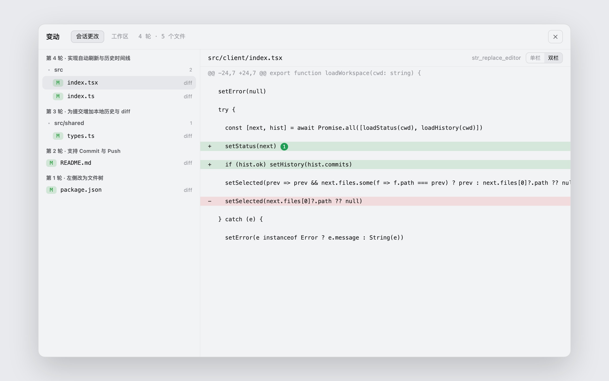

# dsh-plugin-diff-review

**变动（Changes）**插件：一个浮层面板里同时提供两个视角 ——
**会话更改**（每一轮对话中代理修改了哪些文件，逐轮查看，不依赖 git）和
**工作区**（git 工作区全部未提交更改，可采纳/丢弃/提交/推送，并带历史时间线）。

## 截图

工作区视图 —— 已暂存 / 未暂存 / 历史时间线 / 分支与远程，左侧文件树、右侧 diff：



提交详情 —— 点历史时间线中的提交，查看该提交的变动文件树与逐文件 diff：



会话更改 —— 按轮列出代理修改的文件（不依赖 git），右侧查看每处修改的 diff：



## 特性

### 工作区（Workspace）— git 工作树

- 左侧按 git 维度分区，每区一棵文件树：**已暂存**（staged）、**未暂存**（unstaged
  含未跟踪）、**本地提交**（未推送的提交时间线，标注 本地/远程）、**分支与远程**
  （`branch → upstream`、领先/落后、推送）；
- **评审范围切换**（scope 下拉，对齐 Codex 评审面板）：全部 / 未暂存 / 已暂存 /
  提交 / 分支 / 最后一轮 ——「分支」对比所选基线分支的 merge-base diff（只读），
  「最后一轮」只看当前会话最近一轮代理改动的文件；
- **AI 评审（/review）**：头部「评审」按钮 → 按当前范围收集 diff，用
  `ctx.llm` 调模型（模型 = 插件配置 `reviewProvider/reviewModel`，缺省用会话
  当前模型），产出 Codex 式结构化发现（P0–P3、文件行号、置信度、建议代码）与
  总体结论；**结论直接内联显示在 diff 视图里**：顶部常驻结论横幅（✓/✗ +
  发现数 + 模型名，滚动时吸顶），每条发现在对应行下方渲染为发现卡片（优先级
  色条、标题、详情、置信度、建议代码）——单/双栏都支持、无需展开；「发送发现
  给代理」把发现注入会话修复 → 修完再点「评审」复评审；
- **PR(gh) 集成**：当前分支关联 GitHub PR 时，左侧显示 PR 标题与 reviewer 评论
  （`gh pr view` + `gh api`），点评论跳到对应文件行，「发送 PR 评论给代理」聚合
  处理；未安装 gh 或无 PR 时静默隐藏；
- **多仓库**：工作区目录含多个 git 仓库（嵌套/monorepo）时，范围旁出现仓库选择器，
  切换后所有操作针对所选仓库；
- **编辑器联动**：diff 头部「在编辑器中打开」打开该文件，行 hover 的 ↗ 按钮打开
  该行 —— 复用 `dsh-plugin-open-editor`（已扩展支持 file:line：VS Code 系
  `--goto`、vim/nvim/emacs `+N`、Sublime `file:line`）；未装 open-editor 时按钮
  报错提示；
- **逐文件采纳 / 丢弃 / 取消暂存**：`git add` / `git restore`（未跟踪文件直接删除）/
  `git restore --staged`，丢弃需二次点击确认；「全部采纳 / 全部取消暂存 / 全部丢弃」
  一键操作；
- **逐 hunk 操作**：每个 diff hunk 自带 暂存 / 丢弃（未暂存的 hunk）或
  取消暂存 / 丢弃（已暂存的 hunk）按钮，可部分暂存新文件（未跟踪文件也能逐 hunk
  暂存）；hunk 过期（已被其他操作改变）时提示刷新；
- **行内评论**（单栏 + 双栏）：hover diff 行 → `+` → 写下评论（Ctrl/⌘+Enter
  保存），有评论的行左侧高亮并显示数量角标，点击查看/删除；双栏视图左右两侧
  都能加（上下文行两侧同锚，变更行按各自侧锚定）；评论存放在仓库的
  `.git/diff-review-comments.json`（不进工作区、不进 git 历史）；
- **评论随消息自动携带（Codex 式）**：行内评论浮现在**对话框顶部**（与输入卡同
  面料、视觉融合；hover 展开预览，**点击某条评论 → 在评审面板中打开对应变更块**）；
  你在输入框发送下一条消息时，**完整的评审包自动附带**——每条评论 + 对应 diff
  hunk + AI 评审结论（verdict 与发现，如有）——排队注入会话，无需手动按钮；
  评审发现与 PR 评论仍通过面板内「发送」弹层聚合；
- **提交**：输入提交说明，提交已暂存的更改；**推送**：双击确认后推送当前分支；
- 切换工作区或标签页时**自动刷新**（无需手动刷新按钮），打开期间每 15 秒静默刷新；
- 每个文件展示完整 unified diff（单栏 / 双栏切换）。

### 会话更改（Session）— 不依赖 git

- 从当前会话的记录中提取**每一轮（每次用户提问）代理修改的文件**，按轮分组，
  显示该轮提问的内容摘要；
- 每个修改展示**完整的按行 diff**；即使没有 diff 数据，仍会列出文件路径与工具名；
- **完全客户端计算**，工作区是不是 git 仓库都能显示，历史轮次也能回看。

## 一键安装

```sh
# macOS / Linux
bash install.sh
```

```powershell
# Windows（PowerShell）
powershell -ExecutionPolicy Bypass -File install.ps1
```

脚本会：安装运行依赖 → 把插件链接进 `~/.dsh/profiles/node_modules` →
幂等注册到 `cordis.patch.yml` → 提示重启。

### 手动安装

本仓库已包含构建产物（`dist/index.js` 与 `client.js`），可直接使用；修改过源码才需要
先执行 `npm install && npm run build`。

1. **把插件放进 profile 的依赖目录**：

   ```sh
   # macOS / Linux
   ln -sfn "$PWD" ~/.dsh/profiles/node_modules/dsh-plugin-diff-review

   # Windows（PowerShell）
   New-Item -ItemType Junction -Path "$HOME\.dsh\profiles\node_modules\dsh-plugin-diff-review" -Target "$PWD"
   ```

2. **注册到配置**：编辑 `~/.dsh/profiles/web/cordis.patch.yml`：

   ```yaml
   - insert:
       - id: diff-review
         name: dsh-plugin-diff-review
   ```

3. **重启 `dsh web`**，打开任意会话，页头会出现「变动」按钮（带修改数角标）。

## 使用

| 操作 | 效果 |
| --- | --- |
| 点击「变动」 | 打开审查面板，默认停在「工作区」页签 |
| 工作区页签 | 左侧按 已暂存 / 未暂存 / 历史 / 分支 分区，右侧显示 diff |
| **范围下拉** | 全部 / 未暂存 / 已暂存 / 提交 / 分支 / 最后一轮，切换展示的文件集 |
| **仓库选择器** | 工作区含多个 git 仓库时出现，切换后所有操作针对所选仓库 |
| **评审** | 按当前范围调模型产出 P0–P3 发现 + 总体结论；发现叠加在 diff 行，顶部条可发送给代理 |
| 点击文件树中的文件 | 右侧显示该文件的 unified diff |
| **单栏 / 双栏切换** | diff 头部可切换，选择会记住 |
| **hunk 操作** | 每个 hunk 行有 暂存/丢弃 或 取消暂存/丢弃 按钮（只读范围不显示） |
| **行内评论** | 单/双栏 hover 行 → `+` → 输入评论保存；有评论的行显示角标，点击查看/删除 |
| **评论浮层** | 输入框上方显示待发送评论（hover 预览、点击跳转对应变更），发送消息时自动附带 |
| **在编辑器中打开** | diff 头部打开文件；行 hover 的 ↗ 打开该行（经 dsh-plugin-open-editor） |
| 历史时间线 | 显示最近提交（本地/远程标注），点提交 → 该提交的变动文件树 + 逐文件 diff |
| **PR 区** | 左侧显示当前分支的 PR 标题与 reviewer 评论，点评论跳转对应行；可聚合发送给代理 |
| 单文件「采纳 / 取消暂存 / 丢弃」 | `git add` / `git restore --staged` / 恢复该文件到 HEAD（未跟踪文件删除），丢弃需二次点击确认 |
| 「全部采纳 / 全部取消暂存 / 全部丢弃」 | 对全部更改批量操作，丢弃需二次确认 |
| **提交** | 输入说明 → 提交已暂存的更改（无已暂存时按钮禁用） |
| **推送** | 双击确认 → 推送当前分支到上游；「分支与远程」区显示领先/落后数 |

### 设置：字体与字号

在 **设置 → 插件 → 插件配置 → 变动** 卡片中可修改 diff 的字体与字号
（等宽 / 系统字体 / Consolas / JetBrains Mono / Fira Code / Source Code Pro；
字号 11–18px），即时生效并持久化。

> 「采纳」只是**暂存**，不会自动 commit —— 在提交框输入说明后点「提交」，
> 再在「分支与远程」点「推送」。

## 配置

编辑 `~/.dsh/profiles/web/cordis.patch.yml` 中该插件的 `config`：

```yaml
- id: diff-review
  name: dsh-plugin-diff-review
  config:
    statusPath: /diff-review/status          # 工作区状态路由（一般无需改动）
    applyPath: /diff-review/apply            # 采纳/丢弃/取消暂存路由
    applyHunkPath: /diff-review/apply-hunk   # 逐 hunk 操作路由
    commitPath: /diff-review/commit          # 提交路由
    pushPath: /diff-review/push              # 推送路由
    historyPath: /diff-review/history        # 历史时间线路由
    commitDiffPath: /diff-review/commit-diff # 提交 diff 路由
    commentsPath: /diff-review/comments      # 行内评论读写路由
    branchesPath: /diff-review/branches      # 本地分支列表路由
    reviewPath: /diff-review/review          # AI 评审路由
    prPath: /diff-review/pr                  # PR(gh) 上下文路由
    reposPath: /diff-review/repos            # 多仓库检测路由
    reviewProvider: ""                       # AI 评审用 provider（如 deepseek-official）
    reviewModel: ""                          # AI 评审用模型；两者为空时用会话当前模型
    allowedRoots: []                         # 非空时，仅允许审查这些目录下的仓库
```

- `allowedRoots`：安全开关，只约束「工作区」页签的 git 操作；「会话更改」页签
  纯客户端展示，不经过服务器。

## 工作原理

**会话更改**（纯客户端）：从会话快照读取全部对话节点，按用户消息划分"轮"；
每个已完成的工具调用若携带 diff hunks（`resultView` 或 `meta.diffs`），解析为
`{path, oldText, newText}` 并归入对应轮次；没有 diff 数据但能确定是文件修改时，
仍列出路径与工具名；diff 按行渲染（新增绿 / 删除红 / 上下文）。

**工作区**（服务器端）：`git status --porcelain=v1 -z` + `git ls-files --others`
收集变更，`git diff` / `git diff --cached` 取 diff；采纳 = `git add`，丢弃 =
`git restore`，取消暂存 = `git restore --staged`；逐 hunk 操作：index 侧（暂存/
取消暂存）用 `git apply --cached`（hunk 的上下文与 index 完全一致，可靠），
工作区侧（丢弃）用 hunk 文本做行级替换写回文件（`git apply --reverse` 对
hunk 不落在文件末尾的补丁不可靠，故不用）；提交 = `git commit -m`，推送 =
`git push`；历史 = `git log HEAD`（`git rev-list @{u}..HEAD` 标注未推送）；
提交 diff = `git show --format=` + `--numstat`；分支范围 = `git diff $(git
merge-base HEAD <base>)`（只读）；行内评论存于 `git rev-parse --git-dir`
下的 `diff-review-comments.json`；AI 评审 = 按范围收集 diff → 解析模型
（配置 `reviewProvider/reviewModel` 优先，否则取会话最近请求头
`requestHeader().config`）→ `ctx.llm.stream` 严格 JSON 提示词 → 校验发现
（路径必须在评审文件集内，行号钳制）；PR = `gh pr view` + `gh api
pulls/{n}/comments`（无 gh 静默降级）；多仓库 = `git rev-parse
--is-inside-work-tree`/`--show-toplevel` 扫描工作区及其一层子目录。所有 git
命令通过 `execFile` 执行（无 shell），路径参数带 `--` 并拒绝 `..` 穿越与绝对
路径，提交说明拒绝以 `-` 开头，hash 与 hunk 文本严格校验。

## 卸载

1. 从 `cordis.patch.yml` 删除 `diff-review` 条目；
2. 删除 `~/.dsh/profiles/node_modules/dsh-plugin-diff-review` 链接；
3. 重启 `dsh web`。

## 常见问题

- **工作区页签提示「不是 git 仓库」**：该工作区没有 `.git`。不影响「会话更改」页签。
- **某个修改显示「没有 diff 数据」**：该工具调用没有附带 diff hunks。文件路径与
  工具名仍会列出。
- **「提交」按钮不可用**：说明当前没有已暂存的更改 —— 先「采纳」文件或「全部采纳」。
- **「推送」按钮不可用**：说明当前分支没有领先提交，或未配置上游分支（`git push -u` 一次）。
- **hover 时行高跳动？** 已修复：评论/打开按钮改为占位可见（visibility），不再影响布局。
- **「最后一轮」是空的**：终端命令（bash）改文件不会计入会话记录；用编辑工具改文件
  才会被记录。可在会话更改页签确认记录来源。
- **「发送给代理」没反应**：需要当前会话可用；如果注入失败，按钮会退化为复制文本
  （剪切板），把评论粘贴到对话即可。
- **「评审」提示没有可用模型**：在插件配置里设置 `reviewProvider` + `reviewModel`，
  或先让当前会话发过一条消息（评审会复用会话的模型）。
- **「在编辑器中打开」提示失败**：需要已安装 `dsh-plugin-open-editor` 且编辑器
  可执行文件在 PATH 中（见该插件 README 的 `customEditors`）。
- **左侧没有 PR 区**：当前分支没有关联 GitHub PR，或本机未安装/未登录 `gh`。
- **hunk 操作提示「刷新」**：该 hunk 已被其它操作改变（上下文不匹配），重新加载
  面板即可继续。
- **按钮没有出现**：确认已重启 `dsh web`，并检查 设置 → 插件清单 里
  `diff-review` 已加载。
- **未跟踪文件被「全部丢弃」删除了，能找回吗？** 不能 —— 未跟踪文件不在 git
  历史里。这也是丢弃需要二次确认的原因。

## License

MIT
